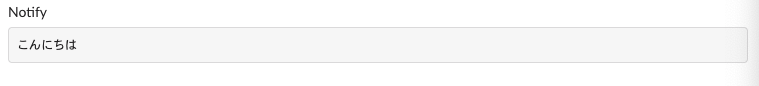

# Slack Notifier

```shell
$ go run main.go -h
Usage:
  slacknotifier [flags]

Flags:
  -c, --channel string   target slack channel id
      --header string    message header
  -h, --help             help for slacknotifier
  -t, --token string     slack api token
```

## Example

```shell
go run main.go -t 'your_slack_token' -c 'target_channel_id' --header 'Notify' 'こんにちは'
```

you get,



you can also use pipeline

```shell
cat example.txt | go run main.go -t 'your_slack_token' -c 'target_channel_id' --header 'Notify'
```